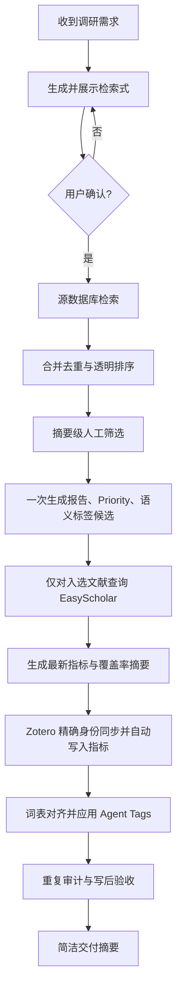

# 文献调研到 Zotero 写入：标准工作流

> 状态：Approved v2，EasyScholar 默认导入契约已实施  
> 范围：从收到主题调研需求、展示检索式，到检索、筛选、EasyScholar 指标补全、Zotero collection 写入、星级与 Agent Tags、重复审计和最终验收。  
> 当前指标约定：EasyScholar API 返回其最新可用指标，不需要配置指标数据年份；展示标签按任务年份减一，例如 2026 年任务写为 `IF(2025)`。API 查询日期只作 provenance。

## 1. 成功标准

一次完整任务只有同时满足以下条件才算完成：

1. 保存并执行用户确认过的检索式和时间范围。
2. 从源数据库检索，而不是用 Zotero 库内搜索代替文献发现。
3. 保存可审计的原始记录、去重排序结果和筛选结果。
4. 只对最终准备进入 Zotero 的文献查询 EasyScholar，减少 API 调用。
5. 为入选文献生成项目内阅读优先级和保守的英文语义标签候选。
6. 新建或复用一个明确的 Zotero collection，按 DOI/PMID 精确匹配。
7. 写入正确年份的期刊指标：`IF(2025)`、`5-Year IF(2025)`、`JCR(2025)`、`CAS(2025)`。
8. 保留既有人工字段、星级、collection 和非 AI4S 标签。
9. 完成重复项只读审计和写后抽查，不以“API 返回成功”代替实际验收。
10. 向用户返回简洁的数量、跳过项、冲突和局限性摘要。

## 2. 总体流程



## 3. 阶段 A：需求解析与检索式确认

### 3.1 最少需要解析的字段

- 科学主题和边界。
- 时间范围；“近三年”转换为明确的起止日期。
- 目标读者和用途，例如入门、系统综述、标书或实验设计。
- 数据库范围：默认 PubMed-first；AI/计算生物学快速发展主题补充 arXiv。
- 是否需要 Web of Science、校园网全文或引文排序。
- Zotero 目标：新 collection 或既有 collection。
- 预计阅读集规模；未指定时，以 20–40 篇精选记录为默认目标，不把全部命中直接灌入 Zotero。

### 3.2 检索式设计

检索式按四层构造：

1. 用户原始概念。
2. 标准同义词和拼写变体。
3. 方法或数据语境。
4. 明确时间窗和必要排除项。

PubMed 使用字段化布尔式；arXiv 使用更短的关键词组，避免把 PubMed 风格的超长同义词串直接复制过去。

### 3.3 用户确认门

在首次联网检索前，向用户展示：

- 完整 PubMed 检索式。
- arXiv/WoS 补充检索式。
- 时间窗。
- 初步纳入与排除标准。

用户确认后才正式检索。查询语义发生实质变化时再次确认；只调整 API 重试、limit 或本地输出不需要重复确认。

## 4. 阶段 B：源数据库检索与可审计证据

### 4.1 数据库顺序

1. PubMed：生物医学同行评议文献主来源。
2. arXiv：仅在主题确实涉及快速发展的 AI/计算方法时补充，并明确标记 preprint。
3. Web of Science：只有用户要求引文分析、特定收录范围或校园网检索时使用。

### 4.2 必须保存的检索证据

- `search_plan.json`：准确查询、时间、数据库、limit、筛选标准。
- `pubmed_raw.json`、`arxiv_raw.json` 等来源文件。
- `ranked_all.json` 与 `ranked_all.csv`：跨来源去重和透明排序结果。
- `report.md`：从保存证据生成的同一份综合报告。

### 4.3 检索质量检查

- 记录各来源命中数、实际下载数和 limit。
- 检查是否出现明显假阳性词义，例如 “digital cell” 指血细胞图像分析设备。
- 检查代表性已知论文是否被召回；若重要论文被自动排名截断，应提高 `top-n`，不能依赖低质量的前若干名。
- 去除同一工作的预印本/正式论文重复时，优先正式发表版本，同时保留来源追踪。
- 不把确定性搜索分数解释为证据质量或星级。

## 5. 阶段 C：人工筛选与一次性综合

### 5.1 入选原则

最终阅读集需要覆盖：

- 概念、路线图或高价值综述。
- 代表性方法与基础模型。
- 数据集和基准评测。
- 反例、局限性或方法批判。
- 与用户具体用途相关的应用研究。

排除：

- 仅标题碰词、正文主题无关的记录。
- 没有计算建模内容的纯湿实验扰动研究，除非它是关键验证数据来源。
- 缺乏稳定身份且无法安全核验的记录，不进入低风险自动创建路径。

### 5.2 同一次综合生成三个输出

完成摘要级筛选时，一次性生成：

1. `report.md`：领域地图、建议阅读顺序、证据局限。
2. `priority_recommendations.json`：默认 Priority 1，只记录提升到 2/3 的论文。
3. `semantic_tag_candidates.json`：每篇 0–4 个英文候选标签；无摘要时最多 2 个且不能标 mechanism。

这样避免为报告、星级和标签分别进行三次逐篇 LLM 审阅。

### 5.3 Priority 解释

- `AI4S:Priority:1`：背景或专题补充。
- `AI4S:Priority:2`：重要方法、综述、机制或反方证据。
- `AI4S:Priority:3`：该项目的核心必读。

Priority 是项目内阅读优先级，不是影响因子、证据等级或永久绝对评价。已有 Priority 是用户所有，普通同步不得覆盖。

## 6. 阶段 D：默认 EasyScholar 查询

### 6.1 默认触发规则

只要用户要求把文献导入 Zotero，默认对**最终入选集合**执行 EasyScholar enrichment；用户明确要求不查询时才跳过。

不要对全部数百条原始命中逐篇查询。正确顺序是：

```text
检索全部记录 → 去重排序 → 人工选定导入集 → EasyScholar 查询导入集
```

### 6.2 调用效率

- 先排除已知 preprint server、会议摘要和无期刊容器记录。
- 按标准化期刊名或 ISSN 去重；同一期刊只查询一次，再映射回多篇论文。
- 使用持久缓存和至少 1 秒的 API 间隔。
- 缓存记录来源、查询日期和原始响应摘要；不得缓存或输出 API key。
- API 失败时只重试瞬时网络错误；没有指标的 preprint 是正常 skip，不应反复请求。

### 6.3 指标展示年份规则

EasyScholar 响应视为最新可用指标，不设置 `EASYSCHOLAR_METRICS_YEAR` 一类数据年份配置。Zotero 展示年份由任务日期确定：

```text
display_metric_year = year(search_date) - 1
retrieved_at = 实际 API 查询日期
source_label = easyscholar-latest
```

例如 2026 年任务显示 `IF(2025)`、`5-Year IF(2025)`、`JCR(2025)`、`CAS(2025)`。

禁止：

- 把查询年份直接写成指标展示年份。
- 因论文发表于 2026 年就把期刊指标标成 2026。
- 对 preprint 伪造 IF/JCR/CAS。
- 在 EasyScholar 未明确返回指标时，从期刊声誉或其他论文推断分区。

### 6.4 Zotero 中的指标表示

- `Extra`：保存版本化的 `IF(2025)`、`5-Year IF(2025)`、`JCR(2025)`、`CAS(2025)` 及 provenance。
- 自定义指标列：IF、5-Year IF、JCR、CAS 都显示为带颜色的“皮肤”；IF/5-Year IF 按 Extra 中的连续数值排序，JCR/CAS 按等级排序。
- Zotero 原生 Tags 面板：额外同步当前 `JCR:Q1|Q2|Q3|Q4` 与 `CAS:1区|2区|3区|4区`，用于原生筛选。
- 不创建 `IF:28.3` 这类高基数原生 tag，避免污染标签选择器；这不影响 IF/5-Year IF 在自定义列中的彩色展示。
- 更新指标时只替换同一年块；保留其他年份和非 AI4S Extra 文本。

## 7. 阶段 E：Zotero 身份、collection 与写入

### 7.1 写入前检查

1. 调用 `zotero_whoami`，自动解析 userID 和写权限；不让用户手输数字 ID。
2. 确认 Zotero Web API 有 write 权限；Local API 只用于读取和匹配。
3. 新项目使用清晰、稳定的 collection 名和 project slug。
4. 对选定条目按 DOI、PMID、标题—年份依次匹配。

### 7.2 低风险自动路径

允许自动执行：

- 唯一 DOI/PMID 命中时复用。
- 完整查询确认无命中后创建具有 DOI/PMID 的新条目。
- 新建唯一 collection。
- 添加 collection membership、项目标签、Article Type 和初始 Priority。
- 创建或更新一份 AI4S-owned Current Report Note。

必须暂停人工审核：

- 标题模糊匹配、标识符冲突或多个候选。
- collection 重名或项目绑定冲突。
- 缺少稳定 ID。
- 超过 50 个新建条目。
- 任何删除、合并、覆盖人工 Note 或其他破坏性动作。

### 7.3 默认执行顺序

`zotero_sync_literature_project` 原生消费 EasyScholar-enriched evidence，在同一次 create/reuse 同步中自动写入指标：

1. 对 selection 中的期刊论文运行 selected-only EasyScholar enrichment。
2. 用 enrichment 后的 evidence 进行 Zotero project sync。
3. create：直接写入 versioned metrics Extra 和当前 JCR/CAS 原生 tags。
4. reuse：只合并 `AI4S-Metrics` 管理块并更新当前 JCR/CAS tags，保留用户 Extra 和其他 tags。
5. 普通结果只报告覆盖数、缺失数、preprint skip 数和展示年份，不显示内部 hash。

只有用户显式要求刷新既有 collection 时，才生成独立 metrics backfill plan，并继续执行 dry-run、精确 hash 确认和 receipt。

## 8. 阶段 F：Agent Tags

### 8.1 词表对齐

导入后调用 `zotero_semantic_tag_context` 获取：

- 最新 item version。
- 当前 `AI4S:Semantic:*` 标签。
- Zotero automatic tags。
- library-scoped 英文词表及 revision。

候选标签必须先与现有词表对齐：有准确 canonical 或 alias 时复用；只有真正缺失的可复用概念才能新建。

### 8.2 自动应用边界

允许自动：

- 替换本批条目的 `AI4S:Semantic:*`。
- 删除同一批条目的 Zotero automatic tags（`type: 1`）。
- 更新 library-scoped 语义词表。

必须保留：

- 人工标签。
- `AI4S:ArticleType:*`。
- `AI4S:Priority:*`。
- `JCR:*`、`CAS:*`。
- collection membership。

## 9. 阶段 G：重复审计与写后验收

### 9.1 重复审计

将新 collection 与整个 Zotero 库按 DOI、PMID、标题、作者和年份比对。

- MCP 只报告 duplicate candidates。
- 不自动 merge、trash 或 delete。
- 确认重复项后在 Zotero Desktop 使用原生 Merge Items。

### 9.2 必须完成的写后验收

至少验证：

1. collection 中 bibliographic item 数量与报告 Note 数量。
2. Priority 1/2/3 数量是否等于筛选计划。
3. 语义标签应用数、冲突数和失败数。
4. EasyScholar update/skip 数；preprint skip 是否符合预期。
5. JCR/CAS 标签分布与 metrics plan 一致。
6. 抽查至少一篇核心论文的完整记录：
   - `by_year` 只包含正确的 `2025` 指标块；
   - `retrieved_at` 是真实查询日期；
   - IF、5-Year IF、JCR、CAS 与 enrichment 一致；
   - Priority、Agent Tags 和其他标签仍存在。
7. 如果本地 API 返回旧版本，先刷新 collection 搜索并比较 item version，再读取详情；不能把缓存旧值误判为写入失败或成功。

只有实际条目检查通过后，才向用户宣布完成。

## 10. 失败处理与恢复

| 情况 | 处理方式 |
|---|---|
| PubMed/arXiv TLS 或临时网络错误 | 按脚本退避重试；保留失败记录，不用网页摘要冒充数据库检索 |
| EasyScholar key 未配置或 API 不可用 | 文献导入继续，结果标记 `metrics_status=unavailable` 并报告缺失；提示通过本地 masked/config 流程配置，不让用户在聊天中粘贴密钥 |
| EasyScholar 无期刊指标 | 标记 `no-easyscholar-metric`，常见于 preprint；不推断 |
| DOI/PMID 多重匹配 | 标记 `check`，暂停写入该条目 |
| Zotero item version conflict | 重新读取最新版本并重建计划；不绕过版本检查 |
| 历史指标展示年份错误 | 用户显式要求后新建纠正计划，写入正确年份并用 `remove_years` 删除错误块；重新 dry-run 和审批 |
| semantic vocabulary revision conflict | 重新读取 context 和词表后再应用 |
| 大批量创建超过 50 条 | 展示 create/reuse/check 摘要并单独确认 |
| 部分写入失败 | 使用 receipt 只重试 pending/failed 项，避免重复创建 |

## 11. 用户交互与审批点

### 必须向用户展示并确认

1. 首次检索式和范围。
2. 高风险匹配或超过 50 条新建。
3. 用户显式要求的既有 collection metrics backfill 计划及精确 hash。
4. citation/其他高风险写入计划的精确 hash。

### 默认无需额外确认

- 已批准检索式后的 API 检索和本地排序。
- 低风险 exact-ID project sync。
- 新导入 create/reuse 的受限 EasyScholar metrics 自动写入。
- 受限的 Agent Tags 自动工作流。
- 只读重复项审计。

### 最终交付格式

最终只需报告：

- collection 名。
- 各数据库命中数、去重后数量、最终导入数。
- created/reused/skipped/conflict 数。
- Priority 分布。
- EasyScholar 指标年份、覆盖数和无指标记录数。
- Agent Tags 成功/冲突数。
- duplicate cluster 数。
- 摘要级或全文级证据局限。

不在普通交付中暴露 API key、内部 receipt 路径、私有库导出或长 JSON。

## 12. 效率检查清单

- [ ] 只在用户确认检索式后开始检索。
- [ ] 源数据库检索与 Zotero 管理严格分层。
- [ ] 原始结果只检索一次；调整筛选时重用保存的 JSON。
- [ ] 报告、Priority、语义候选在同一次摘要综合中生成。
- [ ] EasyScholar 只查询最终入选集，并按期刊去重缓存。
- [ ] 已知 preprint 在 EasyScholar 前跳过。
- [ ] EasyScholar 响应按 latest 使用；展示年份为 `search_date.year - 1`，查询日期只作 provenance。
- [ ] Zotero 调用顺序执行，避免触发 rate limit。
- [ ] 新导入 metrics 自动应用；只有独立回填和 citation 写入经过 dry-run + exact hash。
- [ ] Agent Tags 使用 collection context 一次批量处理，不逐条重复读取词表。
- [ ] duplicate audit 只在最终批次完成后进行一次。
- [ ] 写后抽查真实 Zotero item，而非只信 API 成功消息。

## 13. 已实施能力与后续优化

本次已实施：

1. Project sync 原生接收 EasyScholar enrichment，并在 create/reuse 时写入 versioned metrics 和 JCR/CAS tags。
2. `enrich-easyscholar --selection-json` 只查询入选期刊记录，按期刊缓存并跳过 preprint。
3. API/key 不可用时保存状态并继续文献导入。
4. 新导入指标自动应用且不展示 hash；独立已有 collection 回填仍保留审批门。

后续可优化：

1. **统一写后验收命令**  
   自动比较 selection、Priority、metrics、semantic receipt 与 Zotero collection 的真实状态，并输出紧凑 QA 摘要。

## 14. 建议审核问题

Frank 审核时可重点判断：

1. 默认 20–40 篇精选规模是否合适？
2. 已确认：所有新导入任务默认查询 EasyScholar，但只调用最终入选的期刊论文；preprint 自动跳过。
3. 已确认：IF/5-Year IF 写入 versioned Extra 并在自定义指标列显示彩色“皮肤”，不生成高基数 IF 原生 tags；JCR/CAS 另同步为原生 tags。
4. Priority 3 是否需要设置数量上限或比例建议？
5. arXiv-only 且无 DOI 的前沿论文是否需要一条经过人工确认的导入路径？
6. 已确认：新导入受限 metrics 自动应用；已有 collection 回填仅在用户显式要求时运行并保留 exact-hash 审批。
7. 已完成原生 metrics project sync，普通新导入不再二次回填。
