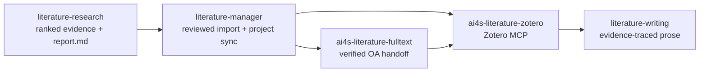

# Literature Workbench

[中文文档](README_CN.md)

> **No Evidence, No Conclusion.** Retrieve auditable evidence, move reviewed records into Zotero, and write only from saved evidence.

Literature Workbench v0.1.0 is a coding-agent plugin for literature retrieval, controlled Zotero workflows, verified public-open-access (OA) fulltext handoffs, and evidence-traced scientific writing. It combines three Agent Skills, two active MCP servers, and an optional Zotero Desktop add-on.

## Overview



The default path is PubMed-first: `literature-research` creates `search_plan.json`, `ranked_all.json`, `ranked_all.csv`, and `report.md`; `literature-manager` imports or synchronizes reviewed selections; the Zotero and optional Fulltext MCPs keep library writes separate from OA verification; `literature-writing` turns the saved evidence into prose with traceable placeholders.

<!-- Screenshot: Real evidence-to-Zotero output with report.md beside the ranked_all.json and ranked_all.csv ranking results. -->
<!--  -->

## Features

- **Auditable retrieval and ranking:** PubMed and arXiv retrieval, deduplication, explicit result caps, ranking reasons, and a bundled reviewed 2025 JCR/IF lookup. Manually obtained official Web of Science exports can be normalized with `import-wos-export`.
- **Controlled Zotero changes:** exact DOI/PMID matching, reviewed hash-gated plans for higher-risk writes, idempotent project/report sync, receipts, read-only duplicate auditing, and no automatic merge or deletion.
- **Metrics and organization:** selected-only EasyScholar enrichment, versioned `AI4S-Metrics`, `AI4S:ArticleType:*`, controlled English `AI4S:Semantic:*` Agent Tags, and safe cleanup of Zotero automatic tags.
- **Explicit AI Summary:** one sentence per paper, Chinese by default, generated only after a direct request and only from the returned title and abstract. Normal import, sync, metrics, tagging, and report updates never trigger it.
- **Verified public OA handoff:** PMC and reviewed public HTTP candidates are validated as PDFs and strongly matched by DOI and title before a private hashed handoff. Zotero attachment writing is a separate controlled step.
- **Evidence-traced writing:** reviews, proposal backgrounds, introductions, discussions, bilingual prose, citation placeholders, and reference-audit tables grounded in saved evidence.

## Quick Start

### Agent bootstrap

Install the plugin with one of the supported harnesses below, open a coding-agent session in the installed plugin directory, and send:

```text
Bootstrap Literature Workbench in this plugin directory. Check that Node.js and npm are at least 20.19, run the native bootstrap script for this OS, then run `node scripts/onboard.mjs status --output onboarding-status.json`. Report only the redacted capability status. Explain that Zotero Web API, PubMed, and EasyScholar credentials are optional, never ask me to paste a key into chat, and remind me that the Zotero Desktop metrics XPI is installed separately and manually.
```

The bootstrap builds and verifies the required Zotero MCP and attempts the optional OA-only Fulltext MCP. Basic retrieval, ranking, and writing remain available without API credentials.

### Manual bootstrap

Requirements: Node.js 20.19+ with npm. The skill scripts also require Python 3 and [`uv`](https://docs.astral.sh/uv/). Run from the plugin directory:

```bash
bash scripts/bootstrap-runtime.sh
node scripts/onboard.mjs status --output onboarding-status.json
```

Windows PowerShell:

```powershell
.\scripts\bootstrap-runtime.ps1
node .\scripts\onboard.mjs status --output .\onboarding-status.json
```

To configure optional credentials, use the masked local wizard—not Agent chat:

```bash
node scripts/onboard.mjs setup --output onboarding-result.json
```

## Installation

| Harness | Confirmed installation route |
| --- | --- |
| Claude Code | `/plugin marketplace add Frankkk1912/AI4S_Workbench`, then `/plugin install literature-workbench@ai4s-workbench` |
| Codex CLI | From a local checkout: `codex plugin marketplace add <repo-path>`, then `codex plugin add literature-workbench@personal` |
| OpenCode / Agent Skill Standard | Copy or link this plugin's `skills/` directories into the harness's documented local skills location. Build the runtimes first and load [`.mcp.json`](.mcp.json) only if the harness supports MCP configuration. |

The supported harness list is intentionally limited to the rows above. MCP runtimes are source-based; every installation needs the native bootstrap step and must not reuse `node_modules`, `dist`, or private environment files from another OS.

## Configuration

All three credentials are optional enhancements:

| Provider | Purpose | Application page |
| --- | --- | --- |
| Zotero Web API | Cloud identity and approved item, tag, note, group-library, or file writes | <https://www.zotero.org/settings/keys> |
| PubMed / NCBI | Higher E-utilities allowance and more stable batch retrieval | <https://www.ncbi.nlm.nih.gov/datasets/docs/v2/api/api-keys/> |
| EasyScholar | Selected-journal rank and metric enrichment | <https://www.easyscholar.cc/> |

Run `node scripts/onboard.mjs reconfigure --provider zotero|pubmed|easyscholar --output onboarding-result.json` to change one provider. The wizard masks and validates input, preserves an existing setting after validation or network failure, and writes only redacted status to its output file. **Never paste credentials into Agent chat or pass them as command arguments.**

Private configuration locations:

| Platform | Zotero MCP | PubMed / EasyScholar |
| --- | --- | --- |
| macOS | `~/Library/Application Support/literature-workbench/zotero.env` | `~/.config/frank-ai4s/academic-research.json` |
| Windows | `%LOCALAPPDATA%\literature-workbench\zotero.env` | `%LOCALAPPDATA%\frank-ai4s\academic-research.json` |
| Linux / WSL | `${XDG_CONFIG_HOME:-~/.config}/literature-workbench/zotero.env` | `${XDG_CONFIG_HOME:-~/.config}/frank-ai4s/academic-research.json` |

Relevant overrides are `ZOTERO_API_KEY`, `ZOTEUS_LOCAL=auto|on|off`, `LITERATURE_ZOTERO_MCP_ENV_FILE`, `AI4S_ACADEMIC_CONFIG_FILE`, and `LITERATURE_FULLTEXT_EXCHANGE_ROOT`. [`.mcp.json`](.mcp.json) fixes the Zotero surface to `LITERATURE_ZOTERO_MCP_TOOL_PROFILE=workbench` and disables embeddings. Zotero Desktop Local API is for key-free reads; approved cloud writes require a write-capable Zotero Web API key, and file attachment upload also requires file permission.

## Prompt Examples

### 1. Retrieve and rank evidence

```text
Search PubMed for the role of GPLD1 in cardiovascular disease using `(GPLD1) AND (cardiovascular disease OR heart failure)`. Cap retrieval at 50, rank the top 30, preserve search_plan.json, ranked_all.json, ranked_all.csv, and report.md, label abstract-only evidence and preprints, and state that the capped search is not exhaustive.
```

### 2. Synchronize reviewed evidence to Zotero

```text
Using my selected, EasyScholar-enriched ranked evidence and finalized report.md, sync project `gpld1-cvd` into the Zotero collection `GPLD1 cardiovascular disease`. Show me any ambiguity or large-create review before proceeding, preserve existing Priority, then generate controlled English Agent Tags and clean only Zotero automatic source tags. After sync, this is an explicit request to generate one Chinese AI Summary sentence per paper from title and abstract only; use missing mode and do not overwrite current summaries.
```

### 3. Retrieve verified public-OA PDFs

```text
For the exact Zotero parent items I selected, check fulltext context first. Fetch only legal public-OA routes, poll the Fulltext MCP job, and apply only a verified hashed handoff. Do not use institutional login, VPN, cookies, or access-control bypass; skip parents that already have a file PDF or need identity review.
```

### 4. Draft evidence-traced prose

```text
From saved ranked_all.json and report.md, draft a bilingual review section on GPLD1 mechanisms in cardiovascular disease. Put an [EV:<index>] placeholder on every scientific claim, distinguish direct evidence from interpretation and open questions, disclose search caps and fulltext status, and include a reference-audit table. Do not reason from Agent Tags or AI Summary alone.
```

## Available Skills

| Skill | Use it for | Primary handoff |
| --- | --- | --- |
| `literature-research` | Source-database retrieval, deduplication, ranking, journal lookup, and auditable reports | `search_plan.json`, `ranked_all.json`, `ranked_all.csv`, `report.md` |
| `literature-manager` | Zotero matching, reviewed imports, collection/report sync, metrics, duplicate audit, Agent Tags, and explicitly requested AI Summary | Private plans/receipts plus Zotero collection, items, tags, Extra, and report Note |
| `literature-writing` | Evidence-traced reviews, proposals, manuscript sections, bilingual prose, and citation audits | Markdown with `[EV:*]`/optional `[ZOT:*]` placeholders and an audit table |

Use the narrow skill for each phase. Zotero library presence is not proof of retrieval completeness, and a retrieval report is not manuscript prose.

## MCP Tools

Only the two servers registered in [`.mcp.json`](.mcp.json) are active. The input names below come from the shipped tool schemas; optional library routing uses `library_type` and `library_id` where shown.

### Zotero MCP — `ai4s-literature-zotero` (workbench profile)

| Category | Tool | Schema inputs |
| --- | --- | --- |
| Identity | `zotero_whoami` | none |
| Search/read | `zotero_search_items` | `q`, `qmode`, `itemType`, `tag`, `collectionKey`, `top`, `since`, `includeTrashed`, `sort`, `direction`, `limit`, `start`, `response_format`, `library_type`, `library_id` |
| Search/read | `zotero_get_item` | `item_key`; optional `include_children`, `include`, `style`, `locale`, `library_type`, `library_id` |
| Search/read | `zotero_get_fulltext` | `item_key`; optional `query`, `page_range`, `max_passages`, `max_chars`, `precise_pages`, `library_type`, `library_id` |
| OA preparation | `zotero_fulltext_context` | `item_keys`; optional `library_type`, `library_id` |
| OA write | `zotero_apply_fulltext_handoff` | `handoff_id`, `handoff_hash`; optional `library_type`, `library_id` |
| Reviewed plan | `zotero_apply_import_plan` | `plan_path`, `mode`; apply also needs `receipt_path`, `confirm_plan_hash` |
| Reviewed plan | `zotero_apply_metrics_plan` | `plan_path`, `mode`; optional `confirm_plan_hash`, `receipt_path`, `library_type`, `library_id` |
| Reviewed plan | `zotero_apply_citation_plan` | `plan_path`, `mode`; optional `confirm_plan_hash`, `receipt_path`, `library_type`, `library_id` |
| Duplicate audit | `zotero_find_duplicates` | exactly one of `collection_key`/`tag`, required `limit`; optional `title_threshold`, `library_type`, `library_id` |
| Agent Tags | `zotero_semantic_tag_context` | exactly one of `item_keys`/`collection_key`; optional `limit`, `start`, `vocabulary_limit`, `vocabulary_query`, `library_type`, `library_id` |
| Agent Tags | `zotero_apply_semantic_tags` | `scope`, `vocabulary_revision`, `items`; optional `cleanup_auto_tags`, `library_type`, `library_id` |
| Agent Tags | `zotero_cleanup_auto_tags` | `scope_type`, `max_items`; optional `collection_key`, `start`, `library_type`, `library_id` |
| Agent Tags | `zotero_semantic_tag_vocabulary` | `action`; optional `path`, `expected_revision`, `limit`, `library_type`, `library_id` |
| Project sync | `zotero_sync_literature_project` | `project_slug`, `search_date`, `report_path`, `evidence_path`; optional `collection_name`, `selection_path`, `priority_recommendations_path`, `confirm_review_id`, `library_type`, `library_id` |
| AI Summary | `zotero_ai_summary_context` | exactly one of `item_keys`/`collection_key`; optional `mode`, `language`, `limit`, `start`, `library_type`, `library_id` |
| AI Summary | `zotero_apply_ai_summaries` | `trigger="explicit-user-request"`, `items`; optional `mode`, `library_type`, `library_id` |

Import, metrics, and citation apply modes require the exact reviewed hash and a receipt path. Duplicate detection is read-only; confirmed merges stay manual in Zotero Desktop. AI Summary `refresh` requires explicit overwrite intent.

### Fulltext MCP — `ai4s-literature-fulltext`

| Category | Tool | Schema inputs |
| --- | --- | --- |
| Capability | `fulltext_capabilities` | none |
| Capability | `fulltext_access_status` | none |
| Deferred interface | `fulltext_session_open` | `institution`; OA-only v0.1.0 returns `INSTITUTION_ACCESS_UNAVAILABLE` and accepts no credentials |
| OA job | `fulltext_fetch_submit` | `request_id`, `route_policy`, `records[]` (`evidence_id`, `zotero_item_key`, at least one of `doi`/`arxiv_id`/`repository_id`, `title`, `item_type`; optional `year`, `candidate_urls`) |
| OA job | `fulltext_job_status` | `job_id` |
| OA job | `fulltext_job_cancel` | `job_id` |

The active v0.1.0 runtime supports public OA only. It does not return PDF bytes/full text in chat, upload directly to Zotero, start a browser, connect a VPN, handle institutional credentials, or bypass access controls.

## Zotero Desktop Metrics

The optional `source/literature-metrics` add-on supports Zotero 7.0–10.9 and is installed separately from the Agent plugin. Build it from a repository checkout:

```bash
cd source/literature-metrics
npm ci
npm test
npm run check
npm run package
```

In Zotero Desktop, open **Tools → Add-ons → gear menu → Install Add-on From File…**, choose `source/literature-metrics/dist/literature-metrics-0.1.13.xpi`, and restart if prompted.

Its eight core read-only evidence/metadata columns are `IF(YYYY)`, `5-Year IF(YYYY)`, `JCR(YYYY)`, `CAS(YYYY)`, `Journal Metrics`, `Article Type`, `Agent Tags`, and `AI Summary`; an explicitly refreshed Semantic Scholar snapshot can also populate `Citations`. `Priority` is the one interactive column: hover and click one to three stars, click the saved level to clear it, or batch-set selected regular items with `1`/`2`/`3` and clear with `0`. The add-on makes no network requests, and its only direct item write is the user's Priority action.

Priority is personal reading/use priority, not evidence quality. An Agent may initialize a missing rating from reviewed report recommendations, but ordinary import never overwrites an existing `AI4S:Priority:1|2|3`. Conflicting Priority tags show a warning instead of being silently resolved.

<!-- Screenshot: Real Zotero Desktop view showing the eight core columns and the interactive one-to-three-star Priority control. -->
<!--  -->

## Roadmap & Support Boundaries

### v0.1.0 scope

- Three coordinated Skills, the 17-tool workbench-profile Zotero MCP, and the 6-tool OA-only Fulltext MCP.
- PubMed/arXiv retrieval and ranking; manually obtained official WoS text export normalization.
- Reviewed Zotero imports, recurring collection/report sync, EasyScholar metrics for new imports, read-only duplicate auditing, Agent Tags, explicitly requested AI Summary, and user-owned Priority.
- Verified PMC/public-HTTP PDF handoff followed by a separate controlled Zotero attachment write.
- Native macOS and Windows bootstrap. WSL is a separately installed compatibility target, not a release gate.

### Explicitly deferred

- Live Web of Science Core Collection browser automation, filtering, count verification, and official export. The retained database-browser runtime is **not registered** in `.mcp.json` and is not an active MCP server.
- Crossref and other commercial-database adapters.
- Institutional SSO, VPN/WebVPN, credential/cookie handling, CAPTCHA bypass, hidden browsers, and institutional fulltext fallback.
- Automatic Zotero duplicate merge/deletion and automatic modification of user-owned Priority.

Public OA is the only supported Fulltext route in v0.1.0. A capped source search is never comprehensive; abstract-level records and preprints must remain labeled, and no metric, summary, or tag substitutes for scientific evidence.

## Project Structure

```text
literature-workbench/
├── .claude-plugin/             # Claude Code manifest
├── .codex-plugin/              # Codex CLI manifest
├── .mcp.json                   # Active Zotero and Fulltext MCP servers
├── docs/onboarding.md          # Credential and first-run guidance
├── runtime/                    # Zotero MCP runtime
├── fulltext-runtime/           # OA-only Fulltext MCP runtime
├── scripts/                    # Bootstrap, onboarding, verification
├── skills/
│   ├── literature-research/
│   ├── literature-manager/
│   └── literature-writing/
├── source/literature-metrics/  # Separately built Zotero Desktop XPI
├── CHANGELOG.md
└── v0.1.0-release-plan.md
```

## Development & Verification

The user-relevant verification paths are backed by committed scripts:

```bash
# Build both runtimes and verify their MCP tool surfaces
bash scripts/bootstrap-runtime.sh

# First-run/onboarding contract
node --test tests/*.test.mjs

# Zotero Desktop add-on
cd source/literature-metrics
npm ci
npm test
npm run check
npm run package
```

On Windows, use `.\scripts\bootstrap-runtime.ps1`; the add-on npm commands are unchanged in PowerShell. See [`CHANGELOG.md`](CHANGELOG.md) and [`v0.1.0-release-plan.md`](v0.1.0-release-plan.md) for release-candidate status and acceptance boundaries.

## License

The Agent plugin, Skills, and shipped MCP runtimes are available under the [MIT License](LICENSE). See [`THIRD_PARTY_NOTICES.md`](THIRD_PARTY_NOTICES.md) for bundled third-party notices.
