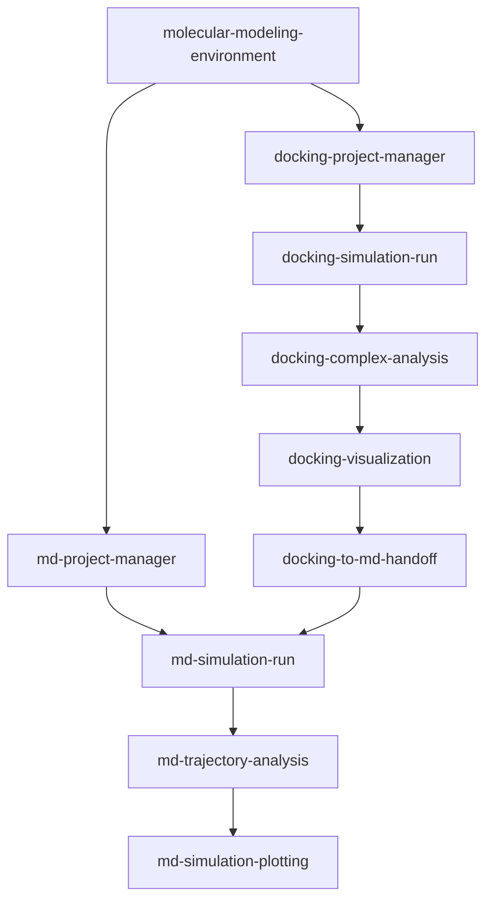

# AI4S Molecular Modeling Workbench

[中文文档](README_CN.md)

> Turn a fragile docking-to-MD toolchain into an auditable workflow you can launch with one prompt.

[](public-release/LICENSE) [](https://github.com/Frankkk1912/AI4S_Workbench) [](https://github.com/Frankkk1912/AI4S_Workbench)

## Overview

AI4S Molecular Modeling Workbench is a Coding Agent plugin that connects environment onboarding, molecular docking, interaction analysis, 3D visualization, ligand parameterization, GROMACS molecular dynamics (MD), trajectory analysis, and publication-grade plotting. Its 12 focused skills turn a toolchain that normally spans many CLIs and hand-written handoffs into guided, file-based workflows for Codex CLI and Claude Code.

The workbench is built for the parts of molecular modeling that are easy to get wrong and hard to reproduce. Its non-destructive onboarding fails closed instead of silently elevating privileges or changing the host. Scientific calculations must run inside WSL2 Ubuntu-22.04 on the native ext4 filesystem—not under `/mnt/*`—while manifests, hashes, and receipts preserve the evidence needed to audit each transition.

Thoughtful safeguards run through the workflow: verified GNINA/GPU docking is preferred with an explicit AutoDock Vina fallback; a selected docking pose and its ligand parameters are bound by SHA256 in a docking-to-MD admission receipt; and staged GROMACS runs validate their predecessors before continuing or resuming. The result is less glue work, fewer hidden assumptions, and a clear path from a one-line prompt to traceable scientific outputs.



Both branches begin with environment evidence; an admitted docking pose can cross into the staged MD branch and continue through analysis and plotting.

<!-- Screenshot: ChimeraX-rendered protein–ligand binding pocket 3D figure produced by the docking-visualization skill / docking-visualization 生成的结合口袋 3D 图 -->
<!--  -->

## Features

- **Onboard without surprises.** Audit Windows 11, Ubuntu-22.04 on WSL2, GPU, Docker, runtime, and scientific CLIs without silent privilege escalation or destructive host changes.
- **Dock reproducibly.** Prefer verified GNINA/GPU execution, fall back explicitly to AutoDock Vina, and preserve normalized poses, engine-specific scores, manifests, and fallback reasons.
- **Analyze and render deterministically.** Extract protein–ligand or protein–protein geometry and contacts with pure Python, then generate editable ChimeraX-first or PyMOL-fallback offline scenes.
- **Gate docking-to-MD transitions.** Bind the selected pose, ligand parameters, force-field compatibility, and protected inputs into a SHA256-backed `md_handoff.json` admission receipt.
- **Parameterize small molecules.** Plan and run the GAFF2/acpype route while producing an auditable `ligand_parameters.json` for MD admission.
- **Run staged GROMACS MD.** Prepare and execute energy minimization, NVT, NPT, and production stages with predecessor validation, progress records, and checkpoint-aware resumption.
- **Separate simulation from analysis.** Run automatic RMSD/RMSF/Rg/SASA/DSSP quality control, then add hypothesis-driven advanced analyses only when the scientific question requires them.
- **Build publication-grade figures.** Convert `.xvg`, `.xpm`, and `.csv` analysis outputs into traceable multi-panel QC, FEL, DCCM/network, and geometry figures.
- **Preserve project memory in PI mode.** Use `docking-project-manager` and `md-project-manager` to retain briefs, decisions, and final evidence-based reports across long projects.
- **Enforce the runtime contract.** Validate locked Python execution, Linux-home paths, tool provenance, immutable container evidence, manifests, and all 12 bundled skills before release.

## Quick Start

### One-line bootstrap via AI Agent

> Paste this into your coding agent to clone the plugin, initialize its WSL-native workspace, and audit every prerequisite before scientific work begins.

```text
Fetch and install the AI4S Molecular Modeling Workbench plugin (https://github.com/Frankkk1912/AI4S_Workbench/tree/main/plugins/molecular-modeling-workbench): clone the repo, then in WSL2 Ubuntu-22.04 run bash scripts/setup-wsl-workbench.sh --agent codex (or --agent claude) to initialize the workbench and generate agent manifests. Then run the molecular-modeling-environment skill to audit required CLIs (GNINA/Vina, GROMACS, acpype, Open Babel, ChimeraX/PyMOL), GPU drivers, Python 3.10–3.12 + uv runtime, and platform prerequisites inside WSL2; report any missing items and guide me through configuring them before first use.
```

The initializer diagnoses the platform, writes an Agent handoff and onboarding checklist, and refuses unsafe paths or unsupported hosts. Review every proposed installation or configuration action; docking and MD remain blocked until `molecular-modeling-environment` writes a current `environment_receipt.json` with `ready: true`.

### Manual installation & configuration

Clone the public repository under the WSL Linux home filesystem, verify the assembled plugin, and choose one supported harness:

```bash
cd "$HOME"
git clone https://github.com/Frankkk1912/AI4S_Workbench.git
cd AI4S_Workbench/plugins/molecular-modeling-workbench
node scripts/assemble-plugin.mjs check
node scripts/verify-plugin.mjs
```

Then run the appropriate initializer from the same directory, review its generated checklist, configure only the missing tools you approve, and use `molecular-modeling-environment` to verify readiness before docking or MD.

## Installation

### Codex CLI

```bash
npm install -g @openai/codex
cd "$HOME/AI4S_Workbench/plugins/molecular-modeling-workbench"
bash scripts/setup-wsl-workbench.sh \
  --agent codex \
  --workspace "$HOME/AI4S-Workbench-Projects"
mkdir -p "$HOME/AI4S-Workbench-Projects/my-project"
cd "$HOME/AI4S-Workbench-Projects/my-project"
codex
```

Complete Codex authentication through its official flow. The setup script records discovery status but never reads or submits credentials; follow the installed Codex version's current client discovery instructions to expose the local plugin skills.

### Claude Code

```bash
cd "$HOME/AI4S_Workbench/plugins/molecular-modeling-workbench"
bash scripts/setup-wsl-workbench.sh \
  --agent claude \
  --workspace "$HOME/AI4S-Workbench-Projects"
mkdir -p "$HOME/AI4S-Workbench-Projects/my-project"
cd "$HOME/AI4S-Workbench-Projects/my-project"
claude
```

Install and authenticate Claude Code using its current official instructions. The generated `agent-handoff.md` records whether `claude` is available and links to those instructions; follow the installed Claude Code version's current client discovery instructions to expose the local plugin skills.

## Configuration

The workbench itself needs **no API key** and defines no `.env` file. Authenticate Codex CLI or Claude Code only through the provider's official flow; never store Agent credentials in project files, prompts, receipts, or screenshots.

Keep scientific commands and large calculation files inside the WSL Linux home filesystem, never `/mnt/c` or another `/mnt/*` mount. The workbench does not intentionally upload structures or trajectories, but Agent providers, registries, credential helpers, and telemetry remain separate trust boundaries. Treat Docker daemon access deliberately: membership in the `docker` group can be equivalent to root-level host control.

| Requirement | Supported configuration | Where and how to configure it |
| --- | --- | --- |
| Platform | Windows 11 with the exact `Ubuntu-22.04` WSL2 distribution | Enable/install WSL and the distribution through reviewed Microsoft instructions; use the non-destructive `scripts/Start-AI4S-Workbench.ps1` preflight before WSL setup. |
| Workspace | Native WSL ext4 under the current Linux `$HOME`; `/mnt/*` is forbidden for scientific execution | Clone the repository and create projects under `$HOME`; `setup-wsl-workbench.sh` rejects mounted or non-ext4 workspaces. |
| Python runtime | Python `>=3.10,<3.13`, `uv`, committed `pyproject.toml` and `uv.lock` | Install `uv` from its official instructions, then run workbench Python commands with `uv run --locked`; do not create an ad hoc dependency set. |
| Docking | GNINA preferred; AutoDock Vina fallback | Install a reviewed user-space GNINA binary and a Vina binary or component prefix. `molecular-modeling-environment` records absolute paths and versions in its receipt. |
| MD | GROMACS (`gmx`) | Select a per-component micromamba prefix, an explicitly approved system installation, or the verified container route; record the resolved path and version. |
| Ligand preparation | acpype/Antechamber and Open Babel (`obabel`) | Manage acpype in a user-controlled Python environment; obtain `obabel` from a component prefix or system installation, then verify both paths and versions. |
| Visualization | ChimeraX preferred; PyMOL fallback | Install ChimeraX manually from its official source; install PyMOL manually or in a component prefix. The workbench does not auto-download licensed or proprietary software. |
| GPU | NVIDIA RTX GPU and compatible Windows/Linux NVIDIA drivers | Configure the driver and WSL GPU bridge manually; the environment skill audits evidence before GNINA/GROMACS GPU execution. |
| GPU container | `nvcr.io/nvidia/gromacs:v2023.3` | Pull through the user-managed Docker/NVIDIA runtime and record the resolved immutable image digest. The mutable tag alone is not release-grade evidence. |

### Runtime Contract

[`runtime-contract.json`](runtime-contract.json) is the source of truth for the locked Python policy, supported onboarding platform, Linux-home workspace rule, external-tool evidence, GPU container reference, and fail-closed boundaries. A missing tool is a failed capability check—not permission to silently switch scientific parameters or backends.

## Prompt Examples

### Audit my WSL2 GPU environment before docking

```text
Use molecular-modeling-environment to audit this Ubuntu-22.04 WSL2 workspace before docking. Check the native ext4 path, Python 3.10–3.12 and uv lock, GNINA/Vina, Docker, NVIDIA GPU evidence, Open Babel, and the visualization tools. Do not install anything or use sudo. Write the checklist, report every missing capability, and propose a reviewable configuration plan.
```

**Expected behavior:** The Agent creates diagnostic artifacts, distinguishes ready capabilities from manual handoffs, and keeps scientific execution blocked until verification succeeds. **Skills:** `molecular-modeling-environment`.

### Run a reproducible GNINA docking workflow with Vina fallback

```text
Create an auditable docking project for receptor [receptor.pdb] and ligand [ligand.sdf]. Validate the ready environment receipt, ask me to confirm protonation, ligand charge, binding-site center, and box size, then run GNINA if its GPU capability is verified or record an explicit Vina fallback. Rank and export individual poses, analyze contacts, and prepare a ChimeraX-first visualization without converting docking scores into binding-energy claims.
```

**Expected behavior:** The Agent saves a project brief, decisions, normalized poses, engine-specific scores, manifests, deterministic contact files, and editable rendering artifacts. **Skills:** `docking-project-manager`, `docking-simulation-run`, `docking-complex-analysis`, `docking-visualization`.

### Validate a selected docking pose before starting ligand MD

```text
For selected pose [pose file], use ligand-parameterization to prepare and finalize a reviewed GAFF2/acpype parameterization with ligand charge [charge]. Then use docking-to-md-handoff to validate topology and force-field compatibility, bind every protected input by SHA256, and write md_handoff.json. Stop if any pose or parameter file changed; do not substitute a charge model or force field silently.
```

**Expected behavior:** The Agent produces `ligand_parameters.json` and a hash-bound `md_handoff.json`, or fails closed with actionable validation errors. **Skills:** `ligand-parameterization`, `docking-to-md-handoff`.

### Run a GROMACS MD simulation and generate publication QC plots

```text
Start an MD project from the ready environment receipt and, for this ligand system, the valid md_handoff.json. Ask me to approve force field, water model, box, salt, temperature, pressure coupling, timestep, and production duration. Run GROMACS energy minimization, NVT, NPT, and production in order with checkpoint-aware resumption. Analyze the completed XTC/TPR for RMSD, RMSF, Rg, SASA, and DSSP, then generate traceable publication-grade multi-panel QC figures. Extract numbers before conclusions and never treat a 100 ps smoke test as convergence evidence.
```

**Expected behavior:** The Agent preserves the pre-simulation brief, stage plans and receipts, trajectory-derived QC data, plotting source data, vector figures, and an evidence-based final report. **Skills:** `md-project-manager`, `md-simulation-run`, `md-trajectory-analysis`, `md-simulation-plotting`.

<!-- Screenshot: 4-panel MD quality-control plots (RMSD/RMSF/Rg/SASA) generated by md-simulation-plotting / md-simulation-plotting 生成的四图稳定性组合 -->
<!--  -->

## Available Skills

| Skill | Description | Trigger |
| --- | --- | --- |
| `molecular-modeling-environment` | Audits, plans, bootstraps, and verifies evidence for WSL2/Linux GPU, Linux SSH, and CPU-fallback profiles. | During first-time onboarding, environment diagnosis, dependency checks, or before docking/MD execution. |
| `docking-project-manager` | Maintains an auditable docking brief, decision log, workflow routing, and final report. | When starting a docking project, recording parameter decisions, or synthesizing final results. |
| `docking-simulation-run` | Prepares and runs GNINA-preferred or Vina-fallback protein–ligand docking with normalized poses, scores, and a manifest. | When executing a reviewed protein–small-molecule docking simulation. |
| `docking-complex-analysis` | Produces deterministic JSON/CSV geometry and contact analysis for protein–ligand or protein–protein complexes. | When an existing complex needs contacts, hydrogen-bond candidates, or binding-pocket residues before visualization or reporting. |
| `docking-visualization` | Generates ChimeraX-first or PyMOL-fallback offline rendering scripts and 3D figures from PDBs or analysis outputs. | When turning a complex or interaction analysis into an editable scientific visualization. |
| `ligand-parameterization` | Plans and runs ligand force-field parameterization and writes handoff-compatible `ligand_parameters.json`. | When a small-molecule ligand needs MD topology and coordinate evidence. |
| `docking-to-md-handoff` | Validates the selected pose against ligand topology evidence and creates hash-bound `md_handoff.json`. | After pose selection and parameterization, before ligand-containing MD admission. |
| `md-project-manager` | Acts as the project PI by preserving a pre-simulation brief and final evidence-based simulation report. | Before a new MD project and after simulation, analysis, and plotting are complete. |
| `md-simulation-run` | Builds and runs staged GROMACS EM/NVT/NPT/production workflows with validation and resumption. | When preparing, running, resuming, or checking a GROMACS simulation. |
| `md-trajectory-analysis` | Separates automatic QC from on-demand hypothesis-driven advanced trajectory analysis. | After `.xtc` and `.tpr` outputs exist, or when a specific advanced question is defined. |
| `md-simulation-plotting` | Creates publication-grade multi-panel QC, FEL, DCCM/network, and geometry plots from analysis data. | After trajectory analysis has produced `.xvg`, `.xpm`, or `.csv` inputs. |
| `molecular-geometry-common` | Shared pure-Python PDB parsing and geometry primitives used by analysis and visualization. | Internal shared library; not a standalone end-user workflow. |

## Roadmap

### Completed

- [x] Released v0.1.0 as the initial WSL2-first public beta.
- [x] Completed v0.2.0 technical acceptance for Windows 11 onboarding preflight, fail-closed WSL initialization, Codex/Claude skill discovery, hash-bound selected-pose export and docking-to-MD validation, and RTX 3080 GPU MD execution.

### Planned

- [ ] Evaluate adding PLIP; the current interaction workflow intentionally uses deterministic pure-Python geometry instead.
- [ ] Add long-timescale MD convergence guidance; the current 100 ps acceptance run is a smoke test only.
- [ ] Keep unsupported boundaries explicit: native-Windows scientific execution and multi-GPU/HPC SLURM scheduling are not supported.

## Project Structure

```text
ai4s-molecular-modeling-workbench/
├── .claude-plugin/
│   └── plugin.json
├── .codex-plugin/
│   └── plugin.json
├── docs/
│   └── ... design, implementation, and acceptance documents
├── plugins/
│   └── ai4s-molecular-modeling-workbench/
├── public-release/
│   ├── CHANGELOG.md
│   ├── CITATION.cff
│   ├── CONTRIBUTING.md
│   ├── LICENSE
│   ├── README.md
│   └── SECURITY.md
├── release-evidence/
│   ├── host-recheck/
│   ├── v0.1-wsl2-acceptance/
│   └── v0.2-windows11-wsl2-rtx3080/
├── scripts/
│   ├── assemble-plugin.mjs
│   ├── run-tests.mjs
│   ├── setup-wsl-workbench.sh
│   └── verify-plugin.mjs
├── skills/
│   ├── docking-complex-analysis/
│   ├── docking-project-manager/
│   ├── docking-simulation-run/
│   ├── docking-to-md-handoff/
│   ├── docking-visualization/
│   ├── ligand-parameterization/
│   ├── md-project-manager/
│   ├── md-simulation-plotting/
│   ├── md-simulation-run/
│   ├── md-trajectory-analysis/
│   ├── molecular-geometry-common/
│   └── molecular-modeling-environment/
├── tasks/
│   └── ... release and onboarding plans
├── tests/
│   ├── manifest.test.mjs
│   ├── onboarding.test.mjs
│   ├── plugin.test.mjs
│   ├── public-export.test.mjs
│   └── technical-acceptance-receipt.test.mjs
├── bundle-manifest.json
├── package.json
├── plugin-meta.json
├── pyproject.toml
├── runtime-contract.json
└── uv.lock
```

`skills/` contains the 12 bundled workflows and shared library; `scripts/` assembles, verifies, tests, exports, and onboards the plugin. `tests/` enforces contracts, while `release-evidence/`, `tasks/`, and `docs/` retain acceptance evidence and engineering decisions. `public-release/` holds release-facing policy and license files, and `plugins/` contains the assembled distribution tree.

## Development

The private `package.json` declares no npm dependencies, so a dependency installation step is not required for the checked-in Node scripts. Use the committed Python lockfile and run the real assembly, verification, and contract-test entry points:

```bash
node scripts/assemble-plugin.mjs check
node scripts/verify-plugin.mjs
npm test
npm run check
```

`npm test` invokes `scripts/run-tests.mjs`, which runs the Node contract tests in `tests/` plus the listed Python skill test suites through locked `uv` execution. `npm run check` combines assembly integrity checking with plugin verification. Use `npm run sync` only when intentionally regenerating the bundled skills and manifests from their source.

## License

AI4S Molecular Modeling Workbench is released under the MIT License. See [public-release/LICENSE](public-release/LICENSE) for the full license text.
