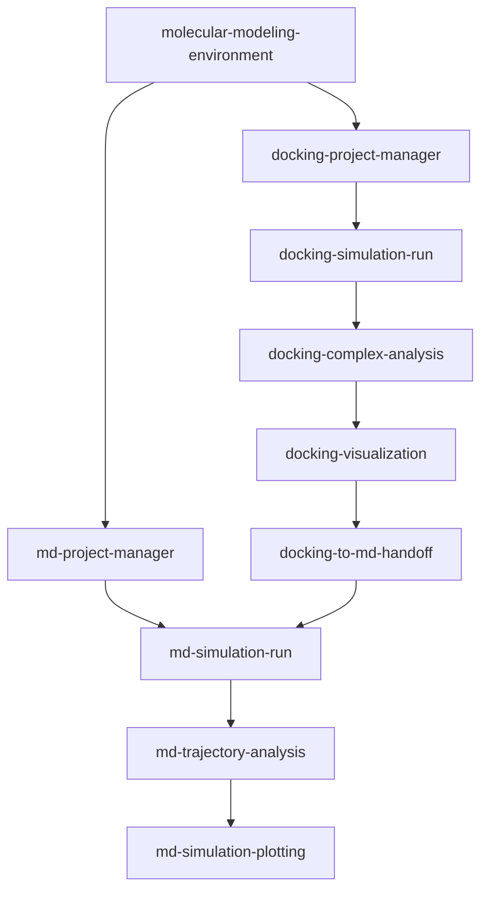

# AI4S 分子建模工作台（Molecular Modeling Workbench）

[English](README.md)

> 把脆弱繁琐的对接到 MD 工具链，变成一句话即可启动、全程可审计的科研工作流。

[](public-release/LICENSE) [](https://github.com/Frankkk1912/AI4S_Workbench) [](https://github.com/Frankkk1912/AI4S_Workbench)

## 概览（Overview）

AI4S 分子建模工作台是一款 Coding Agent 插件，贯通环境引导、分子对接（molecular docking）、相互作用分析、3D 可视化、配体参数化、GROMACS 分子动力学（Molecular Dynamics, MD）、轨迹分析与发表级绘图。12 个各司其职的技能，把原本横跨多个 CLI 和手工交接步骤的工具链，转化为面向 Codex CLI 与 Claude Code 的文件化引导工作流。

工作台专门处理分子建模中最容易出错、最难复现的环节。它以非破坏性方式完成 onboarding，遇到不满足的条件便 fail closed，绝不静默提权或修改宿主机。科学计算必须在 WSL2 Ubuntu-22.04 的原生 ext4 文件系统中运行，禁止置于 `/mnt/*`；manifest、哈希与准入凭证（handoff receipt）则为每次流程转换保留可审计证据。

环境验证通过后优先使用 GNINA/GPU 对接，并明确记录 AutoDock Vina 回退；选定的 docking pose 与配体参数通过 SHA256 绑定到 docking-to-MD 准入凭证；分段 GROMACS 运行会在继续或断点恢复前验证上一阶段。你因此可以少写胶水代码、少承担隐含假设，从一句 prompt 清晰走到可追溯的科研产出。



两条支线都以环境证据为起点；通过准入的 docking pose 可进入分段 MD 支线，并继续完成分析与绘图。

<!-- 截图：docking-visualization 技能生成的 ChimeraX 蛋白–配体结合口袋（binding pocket）3D 渲染图 -->
<!--  -->

## 功能（Features）

- **放心完成环境引导。** 审计 Windows 11、WSL2 Ubuntu-22.04、GPU、Docker、运行时与科学 CLI，不静默提权，也不破坏性修改宿主机。
- **可复现地运行对接。** 优先使用通过验证的 GNINA/GPU，明确回退到 AutoDock Vina，并保留规范化 pose、引擎特异评分、manifest 与回退原因。
- **确定性分析与渲染。** 以纯 Python 提取蛋白–配体或蛋白–蛋白几何与接触信息，再生成 ChimeraX 优先、PyMOL 回退的可编辑离线场景。
- **严格把关 docking-to-MD 转换。** 将选定 pose、配体参数、力场兼容性与受保护输入绑定到 SHA256 支持的 `md_handoff.json` 准入凭证。
- **完成小分子参数化。** 规划并运行 GAFF2/acpype 路径，生成可审计、可用于 MD 准入的 `ligand_parameters.json`。
- **分段运行 GROMACS MD。** 依次准备并执行能量最小化、NVT、NPT 与 production，验证前序阶段、记录进度并支持基于 checkpoint 的断点续跑。
- **让模拟与分析解耦。** 自动完成 RMSD/RMSF/Rg/SASA/DSSP 质量控制，再按真实科研假说添加高级分析。
- **生成发表级图件。** 将 `.xvg`、`.xpm` 与 `.csv` 分析输出转化为可追溯的 QC、FEL、DCCM/network 与几何分析多图组合。
- **以 PI 模式保存项目记忆。** 使用 `docking-project-manager` 与 `md-project-manager` 跨越长周期项目，持续保留 brief、决策和基于证据的最终报告。
- **强制执行运行契约。** 在发布前验证锁定的 Python 执行、Linux home 路径、工具来源、不可变容器证据、manifest 以及全部 12 个技能。

## 快速开始（Quick Start）

### 通过 AI Agent 一句话启动（One-line bootstrap via AI Agent）

> 把下面这段话粘贴给你的 coding agent，即可克隆插件、初始化 WSL 原生工作区，并在科学计算开始前审计全部前置条件。

```text
拉取并安装 AI4S Molecular Modeling Workbench 插件（https://github.com/Frankkk1912/AI4S_Workbench/tree/main/plugins/molecular-modeling-workbench）：克隆仓库，在 WSL2 Ubuntu-22.04 中运行 bash scripts/setup-wsl-workbench.sh --agent codex（或 --agent claude）初始化工作台并生成 agent 清单。随后运行 molecular-modeling-environment 技能审计 WSL2 中必需的 CLI（GNINA/Vina、GROMACS、acpype、Open Babel、ChimeraX/PyMOL）、GPU 驱动、Python 3.10–3.12 + uv 运行时及平台前置条件，列出缺失项并指导我完成首次配置。
```

初始化器会诊断平台、写入 Agent handoff 与 onboarding checklist，并拒绝不安全路径或不受支持的宿主环境。请审阅每项安装或配置建议；在 `molecular-modeling-environment` 写出当前且 `ready: true` 的 `environment_receipt.json` 前，对接与 MD 始终保持阻塞。

### 手动安装与配置（Manual installation & configuration）

在 WSL Linux home 文件系统下克隆公开仓库，验证装配后的插件，再选择一种受支持的 harness：

```bash
cd "$HOME"
git clone https://github.com/Frankkk1912/AI4S_Workbench.git
cd AI4S_Workbench/plugins/molecular-modeling-workbench
node scripts/assemble-plugin.mjs check
node scripts/verify-plugin.mjs
```

随后从同一目录运行对应的初始化器，审阅生成的 checklist，仅配置你批准的缺失工具，并在对接或 MD 前使用 `molecular-modeling-environment` 验证环境就绪状态。

## 安装（Installation）

### Codex CLI

```bash
npm install -g @openai/codex
cd "$HOME/AI4S_Workbench/plugins/molecular-modeling-workbench"
bash scripts/setup-wsl-workbench.sh \
  --agent codex \
  --workspace "$HOME/AI4S-Workbench-Projects"
mkdir -p "$HOME/AI4S-Workbench-Projects/my-project"
cd "$HOME/AI4S-Workbench-Projects/my-project"
codex
```

请通过 Codex 官方流程完成认证。setup 脚本只记录发现状态，绝不会读取或提交凭据；请按照已安装 Codex 版本当前的 client discovery 说明暴露本地插件技能。

### Claude Code

```bash
cd "$HOME/AI4S_Workbench/plugins/molecular-modeling-workbench"
bash scripts/setup-wsl-workbench.sh \
  --agent claude \
  --workspace "$HOME/AI4S-Workbench-Projects"
mkdir -p "$HOME/AI4S-Workbench-Projects/my-project"
cd "$HOME/AI4S-Workbench-Projects/my-project"
claude
```

请按照当前官方说明安装并认证 Claude Code。生成的 `agent-handoff.md` 会记录能否找到 `claude`，并提供官方说明链接；请按照已安装 Claude Code 版本当前的 client discovery 说明暴露本地插件技能。

## 配置（Configuration）

工作台本身**无需 API Key**，也没有定义 `.env` 文件。Codex CLI 或 Claude Code 只应通过提供商官方流程认证；切勿把 Agent 凭据写入项目文件、prompt、收据或截图。

科学命令与大型计算文件必须留在 WSL Linux home 文件系统中，禁止放在 `/mnt/c` 或其他 `/mnt/*` 挂载点。工作台不会主动上传结构或轨迹，但 Agent 提供商、registry、credential helper 与 telemetry 仍属于独立信任边界。请谨慎授予 Docker daemon 访问权限：加入 `docker` group 可能等同于获得宿主机 root 级控制。

| 要求 | 受支持配置 | 配置位置与方式 |
| --- | --- | --- |
| 平台 | Windows 11 与名称严格为 `Ubuntu-22.04` 的 WSL2 发行版 | 按经过审阅的 Microsoft 指引启用/安装 WSL 与发行版；进入 WSL 前可运行非破坏性的 `scripts/Start-AI4S-Workbench.ps1` 预检。 |
| 工作区 | 当前 Linux `$HOME` 下的 WSL 原生 ext4；科学计算禁止使用 `/mnt/*` | 在 `$HOME` 下克隆仓库并创建项目；`setup-wsl-workbench.sh` 会拒绝挂载盘或非 ext4 工作区。 |
| Python 运行时 | Python `>=3.10,<3.13`、`uv`、已提交的 `pyproject.toml` 与 `uv.lock` | 按 `uv` 官方说明安装，再用 `uv run --locked` 运行工作台 Python 命令；不要另建随意的依赖集合。 |
| 对接 | GNINA 优先；AutoDock Vina 回退 | 安装经过审阅的用户空间 GNINA binary，以及 Vina binary 或组件前缀；`molecular-modeling-environment` 会在收据中记录绝对路径和版本。 |
| MD | GROMACS（`gmx`） | 选择按组件隔离的 micromamba prefix、明确批准的系统安装或已验证的容器路径，并记录解析后的路径与版本。 |
| 配体准备 | acpype/Antechamber 与 Open Babel（`obabel`） | 在用户管理的 Python 环境中维护 acpype；从组件 prefix 或系统安装获取 `obabel`，再验证二者的路径与版本。 |
| 可视化 | ChimeraX 优先；PyMOL 回退 | 从官方来源手动安装 ChimeraX；手动或在组件 prefix 中安装 PyMOL。工作台不会自动下载专有或受许可证限制的软件。 |
| GPU | NVIDIA RTX GPU 与兼容的 Windows/Linux NVIDIA 驱动 | 手动配置驱动与 WSL GPU bridge；环境技能会在 GNINA/GROMACS GPU 执行前审计证据。 |
| GPU 容器 | `nvcr.io/nvidia/gromacs:v2023.3` | 通过用户管理的 Docker/NVIDIA runtime 拉取，并记录解析后的不可变镜像 digest；仅记录可变 tag 不足以形成发布级证据。 |

### 运行契约（Runtime Contract）

[`runtime-contract.json`](runtime-contract.json) 是锁定 Python 策略、受支持 onboarding 平台、Linux home 工作区规则、外部工具证据、GPU 容器引用与 fail-closed 边界的唯一事实来源。缺少工具意味着能力检查失败，绝不等于可以静默切换科学参数或后端。

## Prompt 示例（Prompt Examples）

### 在对接前审计 WSL2 GPU 环境

```text
使用 molecular-modeling-environment 在对接前审计这个 Ubuntu-22.04 WSL2 工作区。检查原生 ext4 路径、Python 3.10–3.12 与 uv lock、GNINA/Vina、Docker、NVIDIA GPU 证据、Open Babel 和可视化工具。不要安装任何内容，也不要使用 sudo。写出 checklist，报告每项缺失能力，并提出可审阅的配置计划。
```

**预期行为：** Agent 生成诊断工件，区分已就绪能力与人工 handoff，并在验证成功前持续阻塞科学计算。**涉及技能：** `molecular-modeling-environment`。

### 使用 Vina 回退运行可复现 GNINA 对接工作流

```text
为受体 [receptor.pdb] 和配体 [ligand.sdf] 创建可审计的 docking 项目。验证 ready 环境收据，要求我确认质子化、配体电荷、结合位点中心与 box size；GNINA GPU 能力通过验证时运行 GNINA，否则明确记录 Vina 回退。排序并导出单个 pose，分析接触信息，准备以 ChimeraX 为先的可视化，而且不要把 docking score 转述为结合能结论。
```

**预期行为：** Agent 保存项目 brief、决策、规范化 pose、引擎特异评分、manifest、确定性接触文件与可编辑渲染工件。**涉及技能：** `docking-project-manager`、`docking-simulation-run`、`docking-complex-analysis`、`docking-visualization`。

### 在配体 MD 开始前验证选定 docking pose

```text
针对选定 pose [pose file]，使用 ligand-parameterization 按已审阅的 GAFF2/acpype 路径准备并完成参数化，配体电荷为 [charge]。随后使用 docking-to-md-handoff 验证拓扑和力场兼容性，以 SHA256 绑定每个受保护输入并写入 md_handoff.json。若 pose 或任何参数文件发生变化就停止；不要静默替换电荷模型或力场。
```

**预期行为：** Agent 生成 `ligand_parameters.json` 与哈希绑定的 `md_handoff.json`，否则以可操作的验证错误 fail closed。**涉及技能：** `ligand-parameterization`、`docking-to-md-handoff`。

### 运行 GROMACS MD 并生成发表级 QC 图

```text
从 ready 环境收据开始新的 MD 项目；对于这个配体体系，还要验证有效的 md_handoff.json。要求我批准力场、水模型、box、盐浓度、温度、压力耦合、timestep 与 production duration。依次运行 GROMACS 能量最小化、NVT、NPT 和 production，并支持基于 checkpoint 的断点恢复。分析完成的 XTC/TPR，计算 RMSD、RMSF、Rg、SASA 与 DSSP，再生成可追溯的发表级 QC 多图组合。先提取数值再下结论，绝不把 100 ps smoke test 当成收敛证据。
```

**预期行为：** Agent 保留 pre-simulation brief、各阶段计划与收据、由轨迹得到的 QC 数据、绘图源数据、矢量图件和基于证据的最终报告。**涉及技能：** `md-project-manager`、`md-simulation-run`、`md-trajectory-analysis`、`md-simulation-plotting`。

<!-- 截图：md-simulation-plotting 生成的 RMSD/RMSF/Rg/SASA 四图 MD 质量控制稳定性组合 -->
<!--  -->

## 可用技能（Available Skills）

| 技能（Skill） | 描述 | 触发条件 |
| --- | --- | --- |
| `molecular-modeling-environment` | 审计、规划、bootstrap 并验证 WSL2/Linux GPU、Linux SSH 与 CPU 回退 profile 的环境证据。 | 首次 onboarding、环境诊断、依赖检查，或执行对接/MD 之前。 |
| `docking-project-manager` | 维护可审计的 docking brief、决策日志、工作流路由与最终报告。 | 启动 docking 项目、记录参数决策或综合最终结果时。 |
| `docking-simulation-run` | 准备并运行 GNINA 优先、Vina 回退的蛋白–配体对接，生成规范化 pose、评分和 manifest。 | 执行已审阅的蛋白–小分子 docking 模拟时。 |
| `docking-complex-analysis` | 为蛋白–配体或蛋白–蛋白复合物生成确定性的 JSON/CSV 几何与接触分析。 | 已有复合物需要在可视化或报告前提取接触、氢键候选或结合口袋残基时。 |
| `docking-visualization` | 从 PDB 或分析输出生成 ChimeraX 优先、PyMOL 回退的离线渲染脚本与 3D 图。 | 将复合物或相互作用分析转成可编辑科研可视化时。 |
| `ligand-parameterization` | 规划并运行配体力场参数化，写出兼容 handoff 的 `ligand_parameters.json`。 | 小分子配体需要用于 MD 的拓扑与坐标证据时。 |
| `docking-to-md-handoff` | 对照配体拓扑证据验证选定 pose，并创建哈希绑定的 `md_handoff.json`。 | 完成 pose 选择与参数化之后、含配体 MD 准入之前。 |
| `md-project-manager` | 以项目 PI 身份保存 pre-simulation brief 与基于证据的最终模拟报告。 | 新 MD 项目开始前，以及模拟、分析和绘图完成后。 |
| `md-simulation-run` | 构建并运行分段 GROMACS EM/NVT/NPT/production 工作流，支持验证与恢复。 | 准备、运行、恢复或检查 GROMACS 模拟进度时。 |
| `md-trajectory-analysis` | 将自动 QC 与按需、由假说驱动的高级轨迹分析解耦。 | 已有 `.xtc` 与 `.tpr` 输出，或已定义具体高级问题时。 |
| `md-simulation-plotting` | 从分析数据创建发表级 QC、FEL、DCCM/network 与几何分析多图组合。 | 轨迹分析已生成 `.xvg`、`.xpm` 或 `.csv` 输入后。 |
| `molecular-geometry-common` | 为分析和可视化提供共享的纯 Python PDB 解析与几何原语。 | 内部共享库；不是面向终端用户的独立工作流。 |

## 路线图（Roadmap）

### 已完成（Completed）

- [x] 发布 v0.1.0，作为首个 WSL2-first 公测版。
- [x] 完成 v0.2.0 技术验收：Windows 11 onboarding 预检、fail-closed WSL 初始化、Codex/Claude 技能发现、哈希绑定 selected-pose 导出与 docking-to-MD 校验，以及 RTX 3080 GPU MD 执行。

### 进行中（In Progress）

- [ ] 正式打包、添加 tag 并发布 v0.2.0。

### 计划中（Planned）

- [ ] 评估引入 PLIP；当前相互作用工作流刻意采用确定性的纯 Python 几何计算。
- [ ] 补充长时 MD 收敛指导；当前 100 ps 验收运行仅为 smoke test。
- [ ] 持续明确不支持边界：Windows 原生科学计算，以及多 GPU/HPC SLURM 调度。

## 项目结构（Project Structure）

```text
ai4s-molecular-modeling-workbench/
├── .claude-plugin/
│   └── plugin.json
├── .codex-plugin/
│   └── plugin.json
├── docs/
│   └── ... design, implementation, and acceptance documents
├── plugins/
│   └── ai4s-molecular-modeling-workbench/
├── public-release/
│   ├── CHANGELOG.md
│   ├── CITATION.cff
│   ├── CONTRIBUTING.md
│   ├── LICENSE
│   ├── README.md
│   └── SECURITY.md
├── release-evidence/
│   ├── host-recheck/
│   ├── v0.1-wsl2-acceptance/
│   └── v0.2-windows11-wsl2-rtx3080/
├── scripts/
│   ├── assemble-plugin.mjs
│   ├── run-tests.mjs
│   ├── setup-wsl-workbench.sh
│   └── verify-plugin.mjs
├── skills/
│   ├── docking-complex-analysis/
│   ├── docking-project-manager/
│   ├── docking-simulation-run/
│   ├── docking-to-md-handoff/
│   ├── docking-visualization/
│   ├── ligand-parameterization/
│   ├── md-project-manager/
│   ├── md-simulation-plotting/
│   ├── md-simulation-run/
│   ├── md-trajectory-analysis/
│   ├── molecular-geometry-common/
│   └── molecular-modeling-environment/
├── tasks/
│   └── ... release and onboarding plans
├── tests/
│   ├── manifest.test.mjs
│   ├── onboarding.test.mjs
│   ├── plugin.test.mjs
│   ├── public-export.test.mjs
│   └── technical-acceptance-receipt.test.mjs
├── bundle-manifest.json
├── package.json
├── plugin-meta.json
├── pyproject.toml
├── runtime-contract.json
└── uv.lock
```

`skills/` 包含 12 个已打包工作流与共享库；`scripts/` 负责插件装配、验证、测试、导出与 onboarding。`tests/` 强制执行契约，`release-evidence/`、`tasks/` 与 `docs/` 保存验收证据和工程决策。`public-release/` 存放面向发布的政策与许可证文件，`plugins/` 则包含装配后的分发树。

## 开发（Development）

私有 `package.json` 没有声明 npm 依赖，因此已提交的 Node 脚本无需额外执行依赖安装。请使用已提交的 Python lockfile，并运行真实的装配、验证与契约测试入口：

```bash
node scripts/assemble-plugin.mjs check
node scripts/verify-plugin.mjs
npm test
npm run check
```

`npm test` 会调用 `scripts/run-tests.mjs`，通过锁定的 `uv` 执行来运行 `tests/` 中的 Node 契约测试及列出的 Python 技能测试套件。`npm run check` 会组合执行装配完整性检查与插件验证。只有在明确需要从源技能重新生成已打包技能与 manifest 时，才使用 `npm run sync`。

## 许可证（License）

AI4S 分子建模工作台采用 MIT 许可证发布。完整许可证文本见 [public-release/LICENSE](public-release/LICENSE)。
